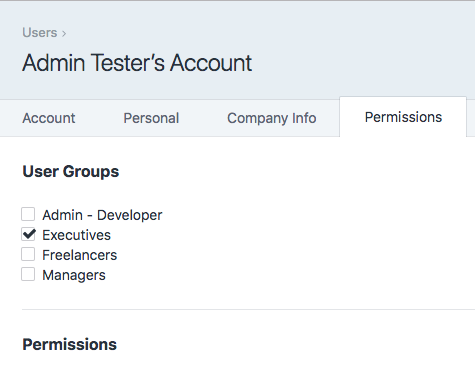
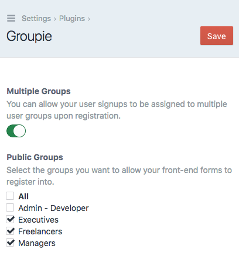

# Groupie plugin for Craft CMS 3.x

Assign users to specific user groups upon registration. Especially useful for front-end signup forms.

## Requirements

This plugin requires Craft CMS 3.0.0-beta.23 or later.

## Groupie Overview

The plugin allows you to choose which user groups you want to allow members to register into, via front end registration forms. You can configure it to allow for registrations into multiple groups or restrict it to one group.



## Configuring Groupie

Groupie is quite easy to setup. Configure the appropriate settings in the CraftCMS control panel.



## Using Groupie

In your front-end `users/save-user` form, just make sure one of your POST variables is `groups`. It can either be an integer or an array of integers representing the desired user Group Ids to assign to that user. You can find the id of a user group from the URL when viewing a particular group in the CraftCMS backend (http://yoursite.com/admin/settings/users/groups/2).

A hidden field would work fine, or a select option or even checkboxes via `name="groups[]"`.

Acceptable post parameters in your frontend forms should look like this...
```
{
  groups: 1
}

// or

{
  groups: [1, 2, 4]
}
```

So your form fields could look similar this...
```
<input type="hidden" name="groups" value="2">

// or

<select type="groups">
  <option value="1">Admin</option>
  <option value="2">Manager</option>
  <option value="3">Editor</option>
</select>

// or

<input type="checkbox" name="groups[]" value="1">
<input type="checkbox" name="groups[]" value="2">
<input type="checkbox" name="groups[]" value="3">
<input type="checkbox" name="groups[]" value="4">
```

Brought to you by [Jesse Knowles](http://www.jesseknowles.com)
